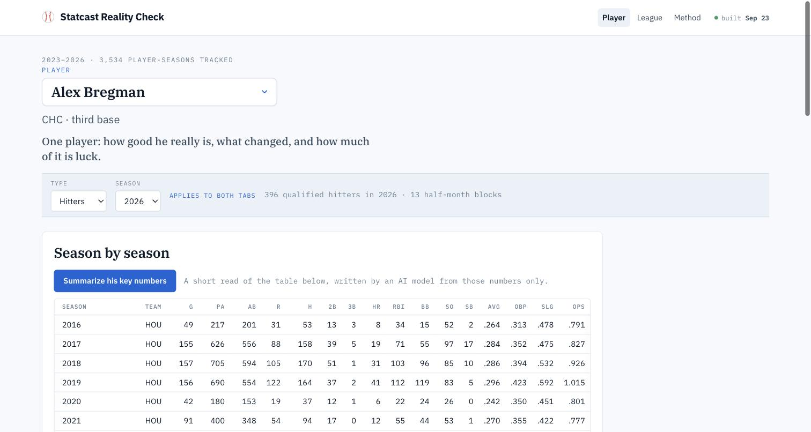
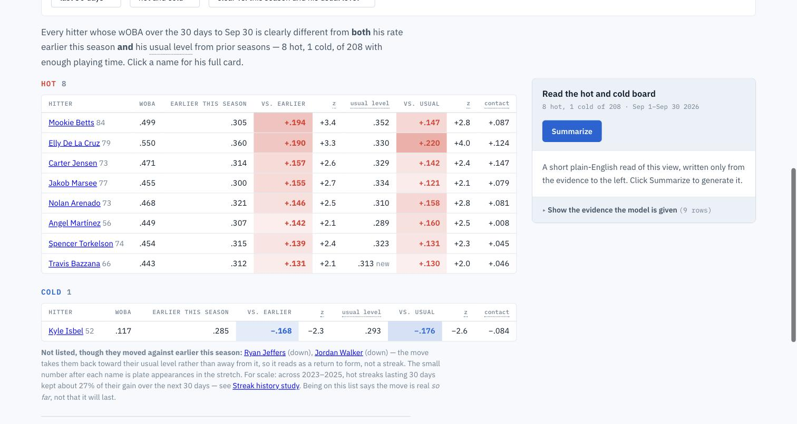

# Statcast Reality Check

[](https://github.com/eliotdmin/statcast-dashboard/actions/workflows/tests.yml)

**[statcast-dashboard.vercel.app](https://statcast-dashboard.vercel.app)** · [technical report](https://statcast-dashboard.vercel.app/report) · [method](https://statcast-dashboard.vercel.app/addendum)

A hitter goes 2-for-30. Is he hurt, has he changed something, or has he just been unlucky? This
project answers that from 2.9 million pitch-by-pitch measurements of the 2023–2026 major-league
seasons, and it is as careful about what the data *cannot* say as about what it can.

Every number on the site is shrunk by how much of it is real at that sample size, and every
forecast is scored against simple rules of thumb before it is believed.



## Three things it found

- **A two-week hot streak keeps about a seventh of its gain.** Six-week streaks keep about
  two-fifths. What makes a streak believable is its length — not, as the broadcast line has it,
  whether the hitter is "squaring the ball up": streaks backed by rising contact quality last no
  longer than lucky ones.
- **What a player *does* is measurable; what *happens to the ball* mostly is not.** Bat speed and
  swing length repeat at .97+ within a season. Sweet-spot rate has no detectable year-over-year
  signal at all. Any story built on one season of it is a story about nothing.
- **Nothing beat a five-line baseline from 2004.** Eight model families, 48 features, gradient
  boosting: none beats Marcel, whose whole trick is regressing hard toward the mean. The value is
  in the shrinking, not in the features.

The [technical report](https://statcast-dashboard.vercel.app/report) has the rest, including
the results that did not work out and the predictions frozen against the 2027 season before that
data exists.

## What the site does

**Player tab** — pick a player, see his whole career, then one analysis at a time:
whether his recent form is real, his luck-adjusted percentiles, which parts of his swing or
approach measurably changed, and his odds against any other player over a window you choose.

**League tab** — who is hot or cold right now, the biggest skill changes league-wide, how much of
each streak a model expects to survive, what streaks have historically done, how well the
head-to-head odds have actually scored, and how much data a question needs in the first place.



Each view can be summarised in plain English by a language model that is given **only** the table
on screen — the same rows you can expand and check — with a fixed rulebook (never call noise a
change, never explain a result by an injury it cannot see, never cite a number that is not in the
evidence).

## How it works

```
Baseball Savant ──> SQLite (1.8 GB, local) ──> per-season JSON shards (~8 MB) ──> static site
     backfill.py        blocks_all.py              web/data/*.json                 Vercel CDN
```

Everything the browser shows is computed in the browser from those shards. The only server code is
one function that holds the model API key. The database never leaves the laptop.

A launchd job runs `refresh.sh` every morning: fetch yesterday's pitches, rebuild the shards,
re-run the studies, check the database for corruption, and deploy — code from the last commit,
data from this morning.

| | |
|---|---|
| Data | 2,891,023 pitches, 2023–2026; 396 qualified hitters in 2026 |
| Site | vanilla JS, no framework, no build step beyond `site/mksite.py` |
| Analysis | Python standard library plus pandas/numpy/sklearn in the one-off studies |
| Deploy | static files on Vercel, one serverless function |

## Running it

```bash
pip install -r requirements.txt
python3 site/mksite.py          # site/  ->  web/
cd web && python3 serve.py      # http://localhost:8787
```

That serves the site against whatever is in `web/data/`. To rebuild the data you need the database
(`backfill.py`, several hours) and then:

```bash
python3 run_pipeline.py --year 2026
```

Set `ANTHROPIC_API_KEY` before `serve.py` to generate summaries locally; without it the site works
and the Summarize buttons explain why they cannot.

## Tests

```bash
python3 tests/test_build.py     # site build: no database needed, runs in CI
python3 tests/test_facts.py     # every published finding, asserted against the database
```

`test_facts.py` is the unusual one. Each published number is asserted against the data, so a
re-backfill or a provider schema change makes a test fail rather than quietly rotting a finding.
Two of them would have caught real bugs that cost days.

## Repository

| | |
|---|---|
| `site/` → `web/` | the site. `site/` is the source; **never hand-edit `web/`** |
| `blocks_all.py`, `streaks.py`, `matchup.py`, `breakouts.py`, `reliability.py` | what the site reads |
| `fetch*.py`, `db.py`, `backfill.py`, `audit.py` | data in, and its integrity |
| `run_pipeline.py`, `refresh.sh`, `deploy.sh` | the daily job |
| `analysis/` | 39 one-off studies behind the findings |
| `DECISIONS.md`, `FINDINGS.md` | why it is built this way, and every measured result |
| `PREREGISTRATION.md` | predictions sealed before the 2027 season exists |

`CLAUDE.md` holds the working agreements and the environment traps worth knowing before changing
anything.

## Honest limitations

- One test season, and it was queried too many times to still be a clean holdout. Every 2026
  figure should be read as optimistic by an unknown amount. 2027 is the clean test.
- Four seasons is a short runway, and swing tracking only starts in 2024.
- Marcel is the floor, not the standard; Steamer and ZiPS were not tested.
- Almost everything is hitters. The pitcher side had one afternoon and immediately showed a larger
  effect.
