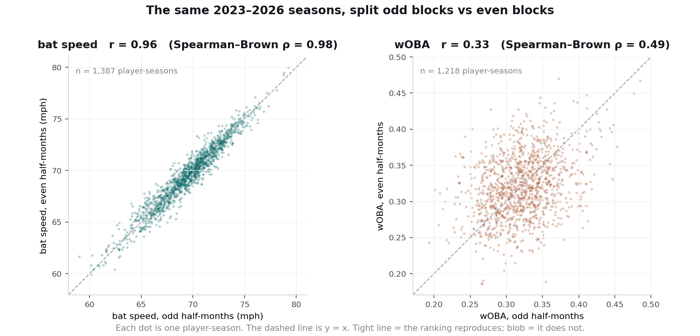

# The statistical program

*Consolidated 2026-09-16. Statistics only — the estimators, the quantities they estimate, what has
been measured, what has failed, and what remains open. No product, no engineering, no interface.
`FINDINGS.md` remains the append-only log; this is its structured index.*

*Math is LaTeX and renders in Obsidian, GitHub and most markdown previewers.*

**How to read this.** Parts 0–II are the machinery: what each quantity is, how it is computed, and
a worked example with real numbers. Parts III–VI are what the machinery produced. Part VII is the
catalogue of mistakes. Parts VIII–IX are what is still wrong and what is still open. If you read
only two sections, read **§1.2** (the three things called reliability) and **§2.1** (what
split-half reliability actually is).

---

## 0. Scope and notation

Four seasons of Statcast pitch-level data, 2023 through 2026-09: 2.84M pitches. Units of analysis
range from the pitch to the player-season. Everything is observational; there are no interventions
and one natural experiment (the 2026 ABS zone).

| symbol | meaning |
|---|---|
| $X$ | an observed rate for one player over one window — his actual bat speed, his actual wOBA |
| $T$ | true talent over that window — what he *would* average if you replayed the window forever |
| $e$ | everything else: opponents, park, defence, sequence, which pitches happened to arrive |
| $n$ | sample size (PA, batters faced, swings, batted balls — always stated) |
| $\rho$ | reliability, $\operatorname{Var}(T)/\operatorname{Var}(X)$ — defined properly in §1.2 |
| $\sigma^2$ | per-PA outcome variance of wOBA $= 0.2258$ (sd $0.475$ per plate appearance) |

A note on $T$. "True talent over this window" is not a philosophical claim, it is a definition: the
number you would get by replaying these exact six weeks infinitely many times with the same hitter,
the same schedule, and different luck. It is unobservable and every technique below is a way of
estimating properties of it without ever seeing it.

---

# Part I — The measurement model

## 1.1 The single decomposition

Everything in this project rests on one sentence: **a stat line is ability plus what happened to
you, and you can only see the sum.**

$$
X \;=\; T + e, \qquad \mathbb{E}[e] = 0, \qquad \operatorname{Cov}(T, e) = 0
$$

**What each piece is saying.** $X$ is the number on the page. $T$ is the part that would show up
again if you ran the window over. $e$ is the part that would not. $\mathbb{E}[e] = 0$ says the luck
is not biased in either direction across infinite replays. $\operatorname{Cov}(T,e) = 0$ says good
players are not systematically luckier than bad ones.

**Worked example.** A hitter posts a .350 wOBA over 100 plate appearances. That .350 is $X$. Suppose
his true ability over that stretch was .320 — then $e = +.030$, thirty points of good fortune: a
seeing-eye grounder, a fly ball that carried, a pitcher who left one up. You never observe the .320
or the .030 separately. You observe .350 and have to reason about the split.

Because the two components are uncorrelated, their variances add:

$$
\operatorname{Var}(X) \;=\; \operatorname{Var}(T) \;+\; \operatorname{Var}(e).
$$

**What this is saying, concretely.** Line up 300 hitters by their wOBA over six weeks. The spread
you see in that column — some at .250, some at .400 — comes from two sources. Some of it is that
they really are different hitters. The rest is that some of them got lucky and some didn't. The
equation says those two contributions add cleanly, without a cross term. **That is the only reason
any of this works**: if you can estimate the total spread and one of the pieces, you get the other
piece by subtraction.

**Where the assumption fails.** $\operatorname{Cov}(T,e) = 0$ is approximately true for batted-ball
outcomes. It is badly false for anything containing team context: a pitcher's win total, RBI, or —
importantly for §4.6 — a pitcher's wOBA-against, which contains his defence. There, "luck" is
correlated with the team you play for, which is correlated with how good you are.

## 1.2 Reliability — and the three different things that share the name

**This is the most important conceptual distinction in the project, and conflating two of them
caused a retraction.** The word "reliability" gets used for three different quantities here:

| | quantity | the question it answers | bat speed | wOBA |
|---|---|---|---|---|
| **A** | reliability of a **level** | *is the ranking of players real?* | .974 | .479 |
| **B** | signal share of a **year-over-year change** | *is this player's season-to-season move real?* | 85% | 68% |
| **C** | signal share of a **month-over-month change** | *is this player's in-season move real?* | **34%** | — |

**Why A and C differ by a factor of three for the same metric.** A *level* is one noisy number. A
*change* is the difference of two noisy numbers, so:

$$
\operatorname{Var}(\Delta_{\text{obs}}) \;=\; \operatorname{Var}(\Delta_{\text{true}})
\;+\; \operatorname{Var}(e_1) \;+\; \operatorname{Var}(e_2),
\qquad
\text{signal share} \;=\; \frac{\operatorname{Var}(\Delta_{\text{true}})}{\operatorname{Var}(\Delta_{\text{obs}})}.
$$

Two things happen at once and both hurt. The **noise doubles** — you inherit the error from the
first window *and* the error from the second. And the **signal shrinks** — talent barely moves
between two windows a month apart, so $\operatorname{Var}(\Delta_{\text{true}})$ is far smaller than
$\operatorname{Var}(T)$ ever was.

**Worked example.** Bat speed is measured almost perfectly: pin down a hitter's *level* at 69.2 mph
and you are confident to a few tenths. But ask whether he gained 0.8 mph from May to June and you
are differencing two numbers each carrying a few tenths of error, against a true month-to-month
movement that is itself only about 0.8 mph wide across the whole league. Hence 34%, not 85%.

**The mistake this caused.** The project reasoned: *bat speed is reliable at ten swings, therefore
monthly bat-speed tracking works.* That is the A → C inference and it is invalid. The
recommendation was retracted.

## 1.3 What reliability buys you — and what it does not

**Buys — a decision rule, not just a description.** This is the part that makes $\rho$ worth
computing rather than merely quoting:

$$
b \;=\; \frac{\operatorname{Cov}(T,X)}{\operatorname{Var}(X)} \;=\; \frac{\operatorname{Var}(T)}{\operatorname{Var}(X)} \;=\; \rho .
$$

**What that chain means.** If you regress the unobservable truth on the observable number, the slope
you would get is exactly the reliability. (The middle step uses
$\operatorname{Cov}(T, X) = \operatorname{Cov}(T, T + e) = \operatorname{Var}(T)$, since $T$ is
uncorrelated with $e$.) So the best estimate of a player's true ability is

$$
\hat{T} \;=\; \mu + \rho\,(X - \mu),
$$

league average plus the fraction $\rho$ of his distance from it. **One measured number does two
jobs**: it tells you how much of a ranking to believe, and it tells you precisely how far to pull
each player back toward the middle. That is §2.3.

**Buys — a budget.** Run the formula backwards and it answers "how much data does this question
need before it can be answered at all?" (§3.2).

**Buys — a common currency.** Bat speed is in mph, wOBA is in wOBA points; they cannot be compared.
Their reliabilities are both numbers between 0 and 1 and can be.

**Does not buy — validity.** A bathroom scale that always reads ten pounds heavy is perfectly
reliable and wrong every time. Reliability measures *consistency*, never *correctness*. The live
example in this data: **arm angle has $\rho = .999$ and is a poor measure of whether a pitcher's
delivery changed**, because it is averaged over every pitch type he throws. Change the pitch mix,
move the number, delivery untouched. High reliability with low validity is the more dangerous
failure, because the number looks authoritative.

**Depends on who is in the pool.** The same metric measured on 300 major leaguers and on 300 random
adults has identical $\operatorname{Var}(e)$ and wildly different $\operatorname{Var}(T)$, so wildly
different $\rho$. Narrow the population and reliability falls even though nothing about the
measurement changed. A reliability quoted without its population and its sample size means nothing —
which is why every figure in this project carries its $n_0$.

---

# Part II — The estimators

## 2.1 Split-half reliability — what it actually is

This is the workhorse of the project, so it gets the longest treatment.

### The question

*If I ranked 300 hitters by this metric over six weeks, and then re-ran those six weeks, how much of
the ranking would come back?*

### The procedure, step by step

1. Take one season. Chop it into half-month blocks: Apr 1–15, Apr 16–30, May 1–15, and so on.
2. For **one** hitter, compute the metric twice — once using only his **odd-numbered** blocks, once
   using only his **even-numbered** blocks. You now have two independent measurements of the same
   player in the same season.
3. Do that for every hitter. You now have a two-column table:

   | hitter | odd blocks | even blocks |
   |---|---|---|
   | Hitter A | 71.4 mph | 71.1 mph |
   | Hitter B | 68.0 mph | 68.6 mph |
   | Hitter C | 73.2 mph | 72.8 mph |
   | … (1,572 rows) | | |

4. **Correlate the two columns.** That correlation is the split-half reliability.

### What the scatterplot looks like, which is the whole intuition

Plot column 2 against column 1. **The shape of that cloud is the answer.**

- **Bat speed**: the raw half-to-half correlation is $r = .95$. The cloud is a tight diagonal line.
  The hitter who swung hardest in his odd blocks swung hardest in his even blocks. The ranking is
  essentially reproducible.
- **wOBA**: the raw half-to-half correlation is $r = .31$. The cloud is a blob. A hitter who ran a
  .380 in his odd blocks is only slightly more likely than average to have run a .380 in his even
  blocks. **Most of the April-to-May reshuffling in a wOBA leaderboard is not hitters changing.**

Here is that scatterplot, drawn from the actual data:

**Left panel:** each dot is one player-season; his bat speed in his odd half-months against his bat
speed in his even half-months. The cloud hugs the diagonal. **Right panel:** the same player-seasons,
same games, same days, but plotting wOBA. It is a shotgun blast. A hitter who ran a .400 in his odd
blocks is about as likely to have run .270 as .400 in his even ones.

Those two pictures are the whole idea. The difference between them is not about baseball — it is
about what the metric is made of. Bat speed is an instrument reading; wOBA is an accumulation of
outcomes, most of which are decided by things other than the hitter.

(The figure computes $r = .96$ and $.33$ because it qualifies players at 120 PA per half; the
headline table's cut gives $.95$ and $.31$. That small gap is §1.3's point about reliability
depending on the pool, showing up in miniature.)

### Why the correlation *is* the variance ratio

The two halves measure the same underlying $T$ with independent errors, so with equal window sizes
(hence $\operatorname{Var}(X_1) = \operatorname{Var}(X_2)$):

$$
r \;=\; \frac{\operatorname{Cov}(X_1, X_2)}{\sqrt{\operatorname{Var}(X_1)\operatorname{Var}(X_2)}}
\;=\; \frac{\operatorname{Var}(T) + \operatorname{Cov}(T,e_2) + \operatorname{Cov}(e_1,T) + \operatorname{Cov}(e_1,e_2)}{\operatorname{Var}(X_1)}
\;=\; \frac{\operatorname{Var}(T)}{\operatorname{Var}(X_1)} .
$$

**The mechanism in words.** The only thing the two halves have in common is the player himself. His
April luck has nothing to do with his May luck ($\operatorname{Cov}(e_1,e_2) = 0$), and neither is
related to his ability ($\operatorname{Cov}(T,e) = 0$). So every cross term in that numerator
vanishes and what is left is the variance of talent, sitting over the variance of the whole
observed column. **A correlation you can compute turns out to equal a variance ratio you cannot.**
That is the trick the entire project runs on.

### One correction before the number is usable

The $r$ you just computed describes **half a season**, because each column only used half the
blocks. A full season is twice as much data and therefore more reliable. Spearman–Brown (§2.2) with
$k = 2$ converts it:

$$
\rho_{\text{full}} \;=\; \frac{2r}{1+r}.
$$

**Worked, end to end.** wOBA's measured half-to-half correlation is $r = .315$. Then
$\rho = 2(.315)/1.315 = .479$. **That is the $.479$ in every table in this document.** Bat speed's
$r = .949$ gives $\rho = 2(.949)/1.949 = .974$.

### What it does *not* mean

- **It is a property of the column, not of any one player.** "wOBA is 48% reliable" does not mean a
  particular hitter's wOBA is 48% accurate. It means that across the 300 hitters you measured, 48%
  of the variance in the ranking is real. Ask it about one player in isolation and it has no answer.
- **It is not accuracy.** See §1.3 — a consistently wrong instrument scores perfectly.
- **It is tied to a sample size.** $.974$ for bat speed is at $n_0 = 207$ PA. At 30 PA it is a
  different number, which is what §2.2 exists to compute.

### Two splits are used here and they disagree slightly

- **odd/even half-month blocks** within a season (`blocks_all.py`; 1,572 hitter-seasons, mean 207 PA
  per half) — the basis of all current tooling.
- **odd/even event index** within a player-season (1,264 hitter-seasons) — the basis of the
  stabilization table.

Bat speed comes out .974 vs .978, wOBA .479 vs .448. **The block split is the more conservative and
the more honest**, because its two halves are separated in *time* and therefore share less of
whatever is not talent — a hot streak, a nagging injury, a stretch of bad opponents. The event-index
split interleaves them, so the two halves can share the same bad week.

## 2.2 Spearman–Brown — moving a reliability between sample sizes

### The question

*I measured this at 207 plate appearances. The user just selected a two-week window. What is the
reliability there?*

### The logic

Watch a player $k$ times as long. His talent does not change, so $\operatorname{Var}(T)$ is
untouched. His luck averages out, so $\operatorname{Var}(e)$ falls to $\operatorname{Var}(e)/k$:

$$
\rho_k \;=\; \frac{\operatorname{Var}(T)}{\operatorname{Var}(T) + \operatorname{Var}(e)/k}
\;=\; \frac{1}{1 + \dfrac{1}{k}\cdot\dfrac{\operatorname{Var}(e)}{\operatorname{Var}(T)}} .
$$

Substituting $\operatorname{Var}(e)/\operatorname{Var}(T) = (1-\rho_0)/\rho_0$ gives the usable form:

$$
\boxed{\;\rho(k) \;=\; \frac{k\,\rho_0}{1 + (k-1)\,\rho_0}\;}
$$

### Worked example

Bat speed, $\rho_0 = .974$ measured at $n_0 = 207$ PA. What is it at **50 PA**?

$$
k = \frac{50}{207} = 0.242,
\qquad
\rho = \frac{0.242 \times .974}{1 + (0.242 - 1)\times .974}
= \frac{0.2352}{1 - 0.7387}
= \frac{0.2352}{0.2613}
= \mathbf{.90}.
$$

Fifty plate appearances of bat speed gives a 90%-real ranking. Run the same arithmetic for wOBA
($\rho_0 = .479$) at 60 PA and you get **.21** — a two-month wOBA leaderboard is about one-fifth
signal.

### Where it is shaky

Two assumptions. The $k$ replications must be **exchangeable** — but April opponents are not
September opponents. And $T$ must be **constant inside the window** — but a hitter who rebuilds his
swing in June violates that outright. Both failures mean real reliability is *lower* than the
formula reports.

**And that is exactly what the validation shows.** The projection predicts month-to-month wOBA
reliability of $.15$ against $.135$ independently measured, and bat speed $.94$ against $.919$
measured. Both optimistic, in the same direction, by a similar margin. Use it for the shape, not the
third decimal.

## 2.3 Shrinkage — turning a reliability into an estimate

### The question

*This hitter is in the 90th percentile of wOBA over six weeks. What percentile is he really?*

### The answer

$$
\hat{T} \;=\; \mu + \rho\,(X - \mu),
\qquad\text{or in percentile terms}\qquad
\text{pct}_{\text{shrunk}} \;=\; 50 + \rho\,(\text{pct}_{\text{raw}} - 50).
$$

Keep the fraction $\rho$ of his distance from average; discard the rest. **This is not a
conservatism adjustment or a fudge factor** — §1.3 showed the regression coefficient of truth on
observation *is* $\rho$, so this is the conditional expectation, the genuinely best guess.

### Worked examples, from the live tool

At **183 plate appearances**, wOBA's reliability is $\rho = .45$ (Spearman–Brown from 207 PA).

- A hitter at the **90th percentile** in wOBA is really estimated at $50 + .45(90-50) = $ **68th**.
- At the same 183 PA, bat speed's reliability is $\rho = .97$. A hitter at the 90th percentile in
  bat speed stays at the **89th**.
- Sweet-spot% at 183 PA is $\rho = .37$. A hitter in the **12th percentile** shrinks all the way to
  the **36th** — the apparent problem mostly evaporates.

That divergence is why the Stretch Finder draws two bars. Same window, same player, same six weeks:
one number barely moves and another moves 22 points.

### The same idea for a change

$$
\hat{\Delta} \;=\; \Delta \cdot \frac{\operatorname{Var}(\Delta_{\text{true}})}{\operatorname{Var}(\Delta_{\text{true}}) + \mathrm{se}^2}.
$$

A change measured with a large error bar gets pulled hard toward zero; a precisely measured one
survives nearly intact. **Worked:** Brett Baty's ground-ball rate appeared to fall 10.4 points
year over year. GB% is 18% signal, so the believable move is **−1.7 points**. Mark Vientos's bat
speed appeared to rise 2.71 mph; bat speed is 85% signal, so the believable move is **+2.3 mph** —
which is genuinely league-extreme. Same report, same method, opposite verdicts.

### The outside reference worth knowing

Efron & Morris, *Scientific American* (1977), "Stein's Paradox in Statistics". They took 18 hitters'
batting averages after 45 at-bats and predicted the rest of the season. Shrinking every player
toward the group mean beat using each player's own average by roughly **3.5× in total squared
error — including for the player who finished the season best.** It is called a paradox because you
improve your estimate of Player A using data from Players B through R, who never faced the same
pitchers. The resolution is §1.1: noise is what makes the observed spread wider than the true
spread, and shrinking corrects the width.

### Marcel is this, in disguise

Tom Tango's Marcel adds $R$ plate appearances of league-average performance to a player's record.
The fraction of his own record that survives is $P/(P+R)$ — **which is exactly the reliability of a
sample of size $P$** when $R = \operatorname{Var}(e)/\operatorname{Var}(T)$ in PA units. Tuning $R$
is estimating a reliability. That is why moving $R$ from 1200 to 3000 (§4.4) more than doubled
$R^2$: the classic constant was simply wrong about how reliable a hitter's record is.

## 2.4 The standard error of a within-player change

### The question

*He hit 67.5 mph over the last six weeks and 68.4 mph before that. Is that a real change?*

### The construction

First, how much of the league's observed spread at sample size $n$ is noise? By definition of
reliability, the unreliable fraction is:

$$
\operatorname{Var}_{\text{noise}}(n) \;=\; \operatorname{Var}_{\text{league}}(n)\,\bigl(1 - \rho(n)\bigr).
$$

Second, noise falls as $1/n$, which lets you carry that estimate to a different window length:

$$
\operatorname{Var}_{\text{noise}}(n_2) \;=\; \operatorname{Var}_{\text{noise}}(n_1)\cdot\frac{n_1}{n_2}.
$$

Third, the two windows both contribute error, and errors add:

$$
\mathrm{se} \;=\; \sqrt{\operatorname{Var}_{\text{noise}}(n_1) + \operatorname{Var}_{\text{noise}}(n_2)},
\qquad
z \;=\; \frac{\text{rate}_{\text{now}} - \text{rate}_{\text{before}}}{\mathrm{se}} .
$$

### Worked example

Alex Bregman, 2026, April 16 – May 30 (183 PA) against the rest of his season (471 PA).

- Bat speed: 67.5 now, 68.4 before. $\Delta = -0.89$ mph.
- League bat-speed spread over a comparable window gives $\operatorname{Var}_{\text{noise}}$, and
  the two windows combine to $\mathrm{se} = 0.62$ mph.
- $z = -0.89 / 0.62 = \mathbf{-1.44}$ → verdict **noise**.

**The instructive part:** bat speed is 97% reliable at this sample size, and a 0.9 mph move still
does not clear the bar. **Reliability of the level and detectability of a change are different
questions** — the first is about telling players apart, the second about telling one player apart
from his own past. This is §1.2's A-versus-C distinction showing up operationally.

Thresholds in use: $|z| \ge 2.5$ real, $1.5 \le |z| < 2.5$ weak, below $1.5$ noise.

## 2.5 Effect size — the other half of the question

### The question $z$ cannot answer

$z$ asks *could chance have produced this?* It says nothing about *is it big?* So:

$$
\Delta_{\text{sd}} \;=\; \frac{\text{rate}_{\text{now}} - \text{rate}_{\text{before}}}{\mathrm{sd}_{\text{league}}}
$$

— the same change measured against how much players differ **from each other** rather than against
measurement error.

### Why you need both, with the two failure directions

**Direction 1 — significant and meaningless.** Arm angle is measured with $\rho = .999$, so the
noise band is nearly zero and almost any drift clears $z = 2.5$. A $0.9^\circ$ change is
statistically unambiguous and **0.07 league standard deviations**. Nobody would notice it. If you
ship only $z$, your tool reports a change every time a pitcher exists.

**Direction 2 — insignificant and large.** Dylan Cease's strikeout rate fell 4.2 points over 242
batters faced. $z = -1.06$ — chance produces that routinely. $\Delta_{\text{sd}} = 0.6$ — a move
anyone would notice if it were real. **The honest sentence is "he may well have changed this much
and this sample cannot tell you,"** which is more useful than either verdict alone and which neither
number produces by itself.

The same distinction appears earlier in the log in its ugliest form: *"Peterson's release extension
moved 0.05 ft and Holmes's 0.01 ft, both statistically real."*

## 2.6 $R^2$, and why it is unreadable without a ceiling

### What $R^2$ is

The fraction of the variance in the thing you are predicting that your prediction accounts for.
$R^2 = 0$ means you did no better than guessing the league average for everyone; $R^2 = 1$ means
perfect. Negative values are possible and appear repeatedly in this project — they mean the model
did **worse** than guessing league average.

### Why the raw number misleads here

You are not predicting true talent. You are predicting **next month's wOBA**, which is itself
$T + e$. So even a forecaster who knew $T$ exactly would score far below 1.0, because he still
cannot predict the $e$ in the target.

$$
R^2_{\max} \;=\; \frac{\operatorname{Var}(T)}{\operatorname{Var}(T + e)},
\qquad
\operatorname{Var}(e) \;=\; \mathbb{E}\!\left[\frac{\sigma^2}{n_{\text{target}}}\right].
$$

### Worked example, with the actual numbers

Target: a hitter's wOBA over the following 30 days, averaging 96 PA. Across the 2026 holdout:

| quantity | variance | as a standard deviation |
|---|---|---|
| observed next-month wOBA | .00341 | .058 |
| of which noise, $\sigma^2/n$ | .00243 | .049 |
| of which true talent | .00097 | .031 |

$$
R^2_{\max} \;=\; \frac{.00097}{.00341} \;=\; \mathbf{0.285}.
$$

**In plain terms:** of the .058 of spread you see in next month's wOBA across hitters, only .031 of
it is hitters actually differing. The other .049 is next month's luck, which nothing observable
today can predict. **A perfect forecaster scores 0.285.**

So when the expected-stats model scores $R^2 = 0.0335$, the right reading is
$0.0335 / 0.285 = $ **12% of everything that exists**, not 3% of perfection. And when recent wOBA
alone scores $0.0038$, that is **1%** — essentially nothing.

**Rule: never report $R^2$ without its ceiling.**

### Three ceilings live in this project and they are different quantities

| ceiling | what the forecaster is assumed to know | value |
|---|---|---|
| **realistic** | true talent, but cannot foresee month-to-month drift | **0.264** (87 PA target) |
| **oracle** | also foresees the drift; unreachable by construction | 0.425 |
| **block-panel** | Var(T)/Var(observed) on the current 30-day panel | **0.285** (96 PA target) |

Components behind the first two: Var(baseline talent) $= .001190$, Var(one month's drift)
$= .000726$, Var(noise at 87 PA) $= .002588$. A superseded earlier version reported $.186$ at 60 PA
because it left the drift term out of the denominator; both circulated for a day before being
reconciled.

## 2.7 The inference machinery, and what each piece is defending against

**Temporal holdout, not a random split.** Fit on 2023–2025, score once on 2026. A random split lets
the model see the future — and in a domain where the league changes annually (the 2026 strike zone
was literally redefined, §7.4), the future is genuinely different. *Defends against:* leakage
through time.

**GroupKFold by player.** When cross-validating inside the training years, every window belonging to
one hitter goes in the same fold. Otherwise the model meets Aaron Judge in fold 1 and is scored on
Aaron Judge in fold 2, and what looks like a skill model is partly an identity lookup. *Defends
against:* leakage through identity.

**Paired percentile bootstrap.** To ask whether model B beats model A: resample the test rows with
replacement 3,000–4,000 times, recompute $R^2(B) - R^2(A)$ on **the same resampled rows each time**,
and read the 2.5th and 97.5th percentiles of that distribution. Pairing is essential — the two
models' errors are highly correlated, so an unpaired comparison produces intervals so wide that
nothing is ever significant. *Defends against:* calling a coin-flip difference a win.

**Bonferroni** where a family of tests is defined in advance — ten counts tested means
$\alpha = 0.005$, not $0.05$. *Defends against:* the best of ten noise results looking real.

**Pre-registration** where an *effect* is at stake. Reliability estimation is explicitly exempt:
"this measures reliability, not an effect, so there is nothing to fish for." *Defends against:*
choosing the hypothesis after seeing the answer.

---

# Part III — What has been measured

## 3.1 Reliability of levels (split-half, Spearman–Brown corrected, 2023–2026)

| hitters, n₀ = 207 PA | ρ | pitchers, n₀ = 176 BF | ρ |
|---|---|---|---|
| swing length | .982 | arm angle | .999 |
| bat speed | .974 | extension | .997 |
| attack angle | .961 | fastball velo | .997 |
| whiff% | .917 | spin rate | .994 |
| chase% | .909 | whiff% | .812 |
| exit velo | .865 | zone% | .801 |
| K% | .861 | K% | .742 |
| xwOBA | .691 | xwOBA against | .534 |
| wOBA | .479 | wOBA against | .389 |
| sweet-spot% | .370 | edge% | .228 |

**The ordering is the substantive result.** Instrument-measured quantities at the top;
outcome-accumulated quantities at the bottom. wOBA, on which the public discourse runs, is below
half.

## 3.2 The same fact, read as a sample-size budget

### Reliability mode — "how much data until this ranking is trustworthy?"

Spearman–Brown run backwards. Instead of *how real is this at $n$?*, ask *what $n$ makes it this
real?* Set $\rho(n) = t$ and solve:

$$
t\bigl(1 + (k-1)\rho_0\bigr) = k\rho_0
\;\Longrightarrow\;
t - t\rho_0 = k\rho_0(1-t)
\;\Longrightarrow\;
\boxed{\;k = \frac{t\,(1-\rho_0)}{\rho_0\,(1-t)},\qquad n = k\,n_0\;}
$$

**Worked example.** wOBA, $\rho_0 = .479$ at $n_0 = 207$ PA. How many PA until the wOBA *ranking* is
70% real?

$$
k = \frac{0.7 \times (1 - .479)}{.479 \times (1 - 0.7)} = \frac{0.3647}{0.1437} = 2.54,
\qquad n = 2.54 \times 207 = \mathbf{525\ \text{PA}} .
$$

Nearly a full season to get a wOBA leaderboard that is 70% signal. Run the same arithmetic for bat
speed ($\rho_0 = .974$) and it is **13 PA**.

**Watch the $(1-t)$ in the denominator.** As your reliability target approaches 1, the required $n$
goes to infinity. Concretely, for wOBA: $t = .7$ costs 525 PA and $t = .9$ costs 2,026 PA —
**3.9× the data for 0.2 more reliability.** The last increment is always the expensive one.

| metric | ρ = .5 | ρ = .7 | ρ = .8 | ρ = .9 |
|---|---|---|---|---|
| swing length | 4 | 9 | 15 | 34 |
| bat speed | 6 | 13 | 22 | 50 |
| attack angle | 8 | 20 | 34 | 76 |
| whiff% | 19 | 43 | 75 | 168 |
| exit velo | 32 | 75 | 129 | 290 |
| K% | 33 | 78 | 133 | 300 |
| hard-hit% | 45 | 105 | 180 | 404 |
| xwOBA | 93 | 216 | 371 | 834 |
| wOBA | 225 | 524 | 899 | **2,023** |
| sweet-spot% | 353 | 823 | 1,411 | **3,176** |

A full season is about 600 PA. **wOBA needs three and a half seasons to be a 90%-real ranking.**
Bat speed needs fifty plate appearances. That contrast is the entire thesis of the project in one
table.

### Detection mode — "how much data until I can confirm *this specific change*?"

A different question, asked by a coach rather than an analyst. Not *is the ranking real* but *he
changed something in the cage — how long until I know it took?* Same decomposition, rearranged into
a standard power calculation, with the noise variance supplied by the reliability estimate instead
of assumed:

$$
n \;=\; n_0\,(1-\rho_0)\,\operatorname{Var}_{\text{league}}(n_0)\left(\frac{z_{\alpha/2} + z_{\beta}}{\delta}\right)^{\!2} \;\equiv\; C .
$$

**Reading the pieces.** $n_0(1-\rho_0)\operatorname{Var}_{\text{league}}(n_0)$ is the noise budget —
how much error one observation of this metric carries. $z_{\alpha/2} + z_\beta$ is the usual
significance-plus-power constant ($1.96 + 0.84 = 2.80$ at $\alpha = .05$ two-sided, 80% power).
$\delta$ is the change you want to be able to catch. **$\delta$ is squared**, so halving the change
you want to detect quadruples the data you need.

**Worked example — the same $\delta$, two very different answers.**

*A pitcher who has lost 1.0 mph off his fastball.* Velocity reliability is $.997$ and the league sd
is 2.4 mph, so the noise budget is tiny. Required: **26 batters faced** — one start.

*A hitter who has gained 1.0 mph of bat speed.* Reliability $.974$, league sd 3.0 mph. Required:
**369 PA** — roughly two-thirds of a season.

Same one mile per hour, a 14× difference in the evidence required. Two things drive it: the pitcher
metric is measured a shade more precisely, and — the bigger factor — hitters are spread more widely
in bat speed than pitchers are in velocity, so one mph is a smaller slice of the hitter
distribution.

### The case where the answer is "never"

The formula above treats the baseline as known exactly. If the baseline is itself only $m$
observations, its error adds to the follow-up window's, so $n = C\,(1 + n/m)$, giving

$$
n \;=\; \frac{C}{1 - C/m},
\qquad\text{with no solution when } C \ge m.
$$

**Worked example.** That same hitter's 1.0 mph of bat speed needs $C = 369$ PA against a known
baseline. Measure him against a **300-PA** baseline and $C > m$: the denominator goes negative and
there is **no follow-up window of any length** that resolves the difference. The baseline itself is
too noisy.

**This is a real answer, not an error condition,** and it is a genuinely non-obvious piece of
experimental design: the remedy is to **lengthen the baseline**, not to watch longer. A hitting lab
comparing a post-change stretch against three weeks of "before" is in this regime and cannot get out
of it by collecting more "after."

Two more worked values: a $2^\circ$ attack-angle change needs **215 PA**; a 30-point wOBA change
needs **1,962 PA** — i.e. nobody is ever confirming a wOBA change inside a season.

## 3.3 Signal share of year-over-year changes (222 hitters, 250+ PA both seasons)

| metric | sd observed | sd noise | sd true | signal share |
|---|---|---|---|---|
| bat speed | 1.10 | 0.43 | **1.01** | 85% |
| xwOBA | .0276 | .0146 | **.0234** | 72% |
| swing% | 3.05 | 1.67 | 2.55 | 70% |
| wOBA | .0356 | .0200 | **.0294** | 68% |
| chase% | 3.36 | 2.14 | 2.59 | 59% |
| whiff/sw% | 3.04 | 2.06 | 2.23 | 54% |
| BB% | 2.47 | 1.84 | 1.65 | 44% |
| K% | 3.45 | 2.71 | 2.13 | 38% |
| exit velo | 1.49 | 1.19 | 0.90 | 37% |
| hard-hit% | 4.61 | 3.93 | 2.42 | 27% |
| GB% | 4.35 | 3.93 | **1.86** | **18%** |

The league-wide version extends this: swing length 87%, edge seen 6%, **sweet-spot% 0%**. Pitchers:
arm angle 100%, extension 100%, velo 99%, spin 97%, down to **BB% 1%, edge% 1%**.

**Consequence.** "+.040 of wOBA is a big move" is now quantified: against a true spread of $.0294$
that is $1.4$ sd, above the 90th percentile of genuine movers. The project's earlier hand-set
practical floor of $.015$ was far too generous.

## 3.4 Signal share of month-over-month changes

| metric | signal share |
|---|---|
| arm angle | 97% |
| fastball velocity | 96% |
| swing length | 43% |
| bat speed | **34%** |
| swing% | 26% |
| chase% | 25% |
| whiff/sw% | **18%** |

Monthly resolution is usable for pitcher mechanics and close to useless for hitter discipline.

## 3.5 Persistence of within-player changes (2026, 30-day windows)

Correlation of a player's delta in window $t$ with his delta in window $t+1$, both against a common
prior baseline:

| metric | r | metric | r |
|---|---|---|---|
| attack angle | +.58 | chase% | +.50 |
| swing length | +.53 | whiff% | +.46 |
| bat speed | +.50 | BB% | +.43 |
| exit velo | +.42 | K% | +.37 |
| hard-hit% | +.39 | | |

Of 1,423 moves past $|z| = 2$ that had a following window, **47% held at least half their
magnitude.**

## 3.6 Mean reversion

Monthly $\Delta(\text{wOBA})$ mean-reverts at $-0.51 \pm 0.026$: half of any month's movement is
given back the next month, mechanically. Any in-season alerting on monthly splits must account for
this.

---

# Part IV — The forecasting program

## 4.1 The descriptive / reliable / predictive triangle

| metric | describes the month | repeats next month | predicts next month |
|---|---|---|---|
| wOBA | 1.000 | 0.135 | 0.065 |
| xwOBA | 0.747 | 0.321 | 0.136 |
| fitted model | 0.485 | **0.665** | **0.205** |

**The better a metric describes the period that happened, the worse it forecasts the next one.**
This is the organising fact of the program and it falls directly out of §1.1: a perfect description
includes $e$, and $e$ does not persist.

## 4.2 Does xwOBA beat wOBA for forecasting? Yes, everywhere

Fit 2023–2025, scored once on 2026; 10,287 hitter-months:

| window | n | wOBA R² | xwOBA R² | edge |
|---|---|---|---|---|
| 1 month | 1,085 | **−0.0038** | 0.0153 | +0.019 |
| 2 months | 856 | 0.0366 | 0.0732 | +0.037 |
| 3 months | 318 | −0.0074 | 0.0297 | +0.037 |
| season → season | 213 | 0.1194 | 0.1274 | +0.008 |

Replicated in an independent design: 12 of 12 season × window combinations, bootstrap intervals
excluding zero in all 12, partial $\beta$ on xwOBA between $0.16$ and $0.43$.

**Two structural findings inside this.**

**(i) Once you know xwOBA, wOBA is negative information.** Fitting
$\;\text{next} \sim b_1\,\text{wOBA} + b_2\,\text{xwOBA}\;$ within input-PA buckets, $b_1$ is
negative in every bucket above 55 PA: $-0.022,\,-0.104,\,-0.075,\,-0.041$. The current 30-day carry
model reproduces it ($b_w = -0.018$, $b_x = +0.228$).

> **Caveat that must travel with this result.** wOBA and xwOBA correlate $\approx 0.6$–$0.7$, so a
> negative partial coefficient is a textbook suppression pattern. It is **not** evidence that
> beating your xwOBA is bad. It is evidence that xwOBA carries the signal and the residual carries
> the noise.

**(ii) A failed prediction, still unexplained.** xwOBA's edge over wOBA was predicted to decline
monotonically with window length. It is humped — peaking at 2–3 months, nearly vanishing over a full
season. No mechanism (backlog S20).

## 4.3 Can anything beat xwOBA?

One-month horizon, 2026 holdout, incremental feature sets:

| feature set | k | ridge | GBM |
|---|---|---|---|
| wOBA only | 1 | −0.003 | −0.012 |
| xwOBA only | 1 | 0.015 | 0.007 |
| + contact quality | 10 | 0.024 | 0.014 |
| + discipline | 18 | 0.030 | 0.027 |
| + context & playing time | 39 | 0.044 | 0.049 |
| + swing geometry | 48 | 0.043 | **0.057** |

**The uncomfortable control: playing time alone scores 0.0316 — double xwOBA's 0.0153.** Removing it
costs the full model a fifth ($0.057 \to 0.044$). This is the manager's private information about a
player's health and role, not a hitting skill, and belongs reported separately rather than buried in
a feature set.

Sort-spread version (2026 hitter-months; realised next-month wOBA spread between top and bottom
fifth): what he just hit **.0098**, xwOBA .0228, the fitted model **.0406**. wOBA is also badly
*calibrated* — its bottom fifth claimed .247 and then hit .329.

## 4.4 The Marcel benchmark: the models draw, and the draw is the finding

One-month horizon, 2026 holdout, 3,000-sample bootstraps, with two fairness corrections made
*against* the project's own models (Marcel's regression constant tuned on the training years; models
re-run on the same weighted history):

| forecaster | R² | 95% CI |
|---|---|---|
| this month's xwOBA | 0.015 | [−.016, +.044] |
| **Marcel, tuned** | **0.058** | [+.016, +.098] |
| 48 Statcast features, current window | 0.057 | [+.013, +.097] |
| weighted Statcast history, 19 features | 0.062 | [+.017, +.105] |
| everything combined | 0.060 | [+.016, +.103] |

48-feature minus Marcel $= -0.002$ [−.039, +.033], $P(\text{model better}) = 0.46$. Everything minus
Marcel $= +0.002$, $P = 0.55$. **Every head-to-head gap straddles zero.**

Season level, $n = 245$: Marcel tuned **0.164**; a shrunk average of past xwOBA **0.166**
($P = 0.53$, a tie); Marcel classic ($R = 1200$) 0.075; a 20-feature GBM **−0.060**, worse than
predicting league average for everyone (gap $-0.228$, $P = 0.00$), on 267 training seasons.

**Marcel+ decomposition — the only free lunch found:**

| step | R² | vs classic | P |
|---|---|---|---|
| Marcel classic (wOBA, R = 1200, age) | 0.0745 | — | — |
| built on xwOBA history | 0.0770 | +0.0038 | 0.53 |
| **+ regress harder (R = 3000)** | **0.1640** | **+0.0928** | **0.97** |
| + structural gap adjustment | 0.1516 | +0.0798 | 0.93 |

One constant more than doubles $R^2$. The past-to-future correlation of a hitter's weighted record
is only $0.40$, so the classic constant badly under-regresses. Marcel's age adjustment is also real:
removing it costs $0.062$ ($P = 0.01$).

**Where Statcast does win — thin track record.** Monotone across four history quartiles:

| prior history | n | Marcel | model | gap | P(model better) |
|---|---|---|---|---|---|
| least | 272 | 0.007 | 0.056 | **+0.049** | **0.94** |
| second | 271 | 0.042 | 0.052 | +0.011 | 0.65 |
| third | 271 | 0.117 | 0.105 | −0.014 | 0.31 |
| most | 271 | 0.048 | 0.008 | −0.040 | 0.11 |

By age, only 22–25 has a CI excluding zero ($+0.065$ [+.003, +.125], $P = 0.98$). **With 4 age
buckets × 4 history quartiles = 8 tests, one CI excluding zero at 5% is what chance produces.**
Recorded as a hypothesis for 2027, not a finding.

A correction is attached: *"expected metrics beat track record for young players"* is **not**
supported — xwOBA alone loses to Marcel in every age bucket. The supportable claim is that a rich
measurement model beats a track-record forecast where the track record is thin, and loses where it
is thick.

## 4.5 The 30-day panel (current tooling)

Windows of two half-month blocks stepping through each season; baseline $=$ strictly prior blocks;
target $=$ the following window. Fit 2023–2025, scored on 2026 (3,884 train / 1,044 test):

| model | 15 d | 30 d | 45 d |
|---|---|---|---|
| M1 recent wOBA + prior wOBA | −0.001 | 0.0038 | 0.0072 |
| M2 + xwOBA (current and prior) | 0.0222 | 0.0335 | 0.0385 |
| M3 + input levels | 0.0313 | 0.0297 | 0.0395 |
| M4 + input **changes** | 0.0302 | 0.0301 | 0.0351 |
| ceiling | 0.277 | 0.285 | 0.245 |

**M4 − M2 never excludes zero:** $+0.0079$ [−.0023, +.0178] at 15 days, $-0.0034$ [−.0176, +.0097]
at 30, $-0.0033$ [−.0238, +.0166] at 45. The 15-day sign points where theory predicts —
corroboration should matter most where the results sample is smallest — and is not significant.

Effect size of the input-change composite: **$+0.004$ of wOBA per standard deviation.** Splitting hot
streaks by whether the body corroborated moves the carry rate from 27% to 32%; gap CI
[−12%, +22%], $P(\text{gap} > 0) = 0.73$.

**The paradox to keep.** Those same input changes persist strongly (§3.5, $r = .37$–$.58$) and do
not move next month's wOBA. Persistence of an input and predictive power for an outcome are
different properties; the second additionally requires the input to be *large in outcome units*. It
is not — a full standard deviation of body change is worth four points of wOBA, against a wOBA noise
sd many times that at monthly samples.

## 4.6 Pitchers

Next-season wOBA-against (426 train pairs, 193 test):

| predictor | test R² |
|---|---|
| wOBA against | 0.1263 |
| **xwOBA against** | **0.1695** |
| K% and BB% only | 0.1558 |
| xwOBA + K% + BB% | **0.1866** |

xwOBA-against beats wOBA-against by 34% relative — a much larger edge than the hitter version. And
**K% and BB% alone nearly match expected wOBA using no batted-ball data at all**, a clean
reproduction of DIPS (McCracken, 1999) on modern data.

30-day panel for pitchers: M1 $0.0292$, M2 $0.0512$, ceiling $0.3537$ — 14% of it.

**xERA carries no information beyond xwOBA.** Savant's own glossary: *"a simple 1:1 translation of
xwOBA, converted to the ERA scale."* A monotone rescaling. True ERA is not reconstructible from the
archive at all, because earned-versus-unearned is a scorer judgement not present in the data.

---

# Part V — The luck gap (wOBA − xwOBA)

The project's one genuinely open empirical question, and the one with the longest error history.

**Within a season the gap is noise.** Split-half reliability of the gap itself: **.164** (hitters),
**.213** (pitchers).

**Across seasons, for hitters, it is a small real trait.** Season-to-season correlation across three
independent year pairs: **+0.267, +0.302, +0.238** (corrected; pre-correction +0.291, +0.280,
+0.272 — robust to the `woba_value` fix). For pitchers the same quantity is **+0.104, −0.021,
+0.161**, i.e. nothing. A hitter trait and not a pitcher trait, which is itself informative.

Magnitude: $\mathrm{sd}(\text{gap}) \approx .019$ at season scale; $.042 / .031 / .026$ at 1 / 2 / 3
months. Persistent over-performers across 3+ seasons: Altuve +.048, Friedl +.048, Paredes +.040.
Under: S. Perez −.024, Soto −.021, Conforto −.021.

**What explains it: almost nothing, and both proposed mechanisms have failed.**

- **Batted-ball profile regression**, 849 player-seasons with 300+ PA: multiple $R^2 = 0.133$. The
  largest single predictor is average exit velocity at **−0.335** — hard-hit hitters systematically
  *underperform* their xwOBA. About 87% unexplained, and that is an upper bound on luck rather than
  an estimate of it, because park, defence faced and speed are all absent.
- **Retracted mechanism 1 — ground balls and reached-on-error.** Appeared to explain the gap (ground
  balls $+.0234$ per batted ball; "52% of it is reached-on-error"). Killed entirely by the
  `woba_value` correction: the corrected ground-ball gap is **+.0008**. The mechanism was measuring
  the project's own numerator.
- **Retracted mechanism 2 — the same effect as a projection adjustment.** Correlation of prior GB
  rate with the current season's gap: $-0.002$ train, $+0.113$ test. Magnitude check:
  $.0234 \times .09 \times .65 = .0014$ of wOBA per sd of GB rate, against a gap sd of $.0188$ —
  **7.3% of the gap's spread.** Adding a player's own prior gap is actively harmful ($-0.181$,
  $P = 0.01$).
- **Not a disguised mechanical change.** Bat-speed change 2025→2026 against the 2026 gap, 222
  hitters: $r = -0.036$ [−0.167, +0.096]. Null.
- **Sprint speed is effectively null:** $-0.00093$ wOBA per ft/s, $R^2 = 0.0034$, $n = 389$,
  $F \approx 1.3$, $p \approx 0.25$. Across the full 22.1–30.5 ft/s range that is $\approx 8$ points
  of wOBA.

**What survives.** xwOBA over-rates popups by 17.6 points (7% of balls in play, so small). The
persistent hitter gap is real, replicated three times, and **unexplained**.

**Candidate explanations, none tested.** xwOBA is blind to spray angle, park, defensive positioning,
and a hitter's own ability to beat out grounders. Any of these could be the persistent trait. The EV
coefficient's sign suggests either that defenders position for hard contact, or that xwOBA
over-credits the top of the EV range.

---

# Part VI — The pitch-level programs: a set of credible nulls

These matter statistically because they are the project's best examples of **nulls that are
believable**, and of the design feature that makes a null believable.

## 6.1 Sequencing: changing the pitch does not help

League, count-baselined, 525,900 paired pitches: repeating beats changing by
**+0.58 runs per 100, 95% [+0.44, +0.71]**. Largest in even counts (+0.97) and two-strike counts
(+0.92). Pitchers already change about two thirds of the time.

**The positive control.** Within pitcher, each against himself in the same count, 360 pitchers:
**+0.563 [+0.425, +0.702]** — essentially identical to the pooled estimate, so the effect is not
composition. This result exists explicitly to license the nulls around it: *a null is uninformative
unless the design can be shown to detect something.*

**And the precision limit is stated rather than assumed.** The design detects $\approx 0.56$
runs/100 at this sample; it says nothing about $0.15$. A formal power calculation has not been done
and would replace this reasoning by analogy.

**Individual pitchers: not identifiable.** One starter-season $\approx 2{,}900$ pitches, se
$\approx 1$ run per 100 — nearly twice the league effect size. Of five 2025 innings leaders, one
cleared at 95%, which is what chance produces. Persistence across seasons: $r = -0.069$
[−0.249, +0.116], 115 pitchers.

## 6.2 Pitch selection by count: between-pitcher selection, not skill

League level, 2025: fastballs beat offspeed in every count with 0 or 1 strike and lose in every
2-strike count, no exceptions. The 2-2 gap is $-0.80$ runs/100.

**The pre-registered within-pitcher test killed it.** The 2-2 gap within pitcher is
**+0.12 [−0.21, +0.45]** across 351 pitchers. The league-level $-0.80$ was almost entirely
between-pitcher selection. With Bonferroni across ten counts ($\alpha = 0.005$), only 1-2 survives
($+0.44$ [+0.19, +0.70]). Persistence of any per-pitcher gap: 2-2 $r = +0.03$ [−0.14, +0.20].

Conclusion as written: *there is no per-pitcher pitch-selection recommendation supportable from
three seasons of public data.*

## 6.3 Two more clean nulls, and one canonical artifact

- **Tunnelling.** 340k swings; excess whiff by release-point gap: $-0.14 / +0.14 / +0.08 / -0.24$
  pp. No ordering. (Caveat: release distance is not trajectory separation at the commit point.)
- **Arsenal breadth does not blunt the times-through-the-order penalty.** The TTO penalty itself is
  real and within-pitcher ($-0.0094 \to +0.0146$ from pass 1 to pass 3, $+24$ points). Slope of the
  penalty on effective arsenal size, 337 starter-seasons: $-0.0027 \pm 0.0040$, null.
- **Velocity decay — keep as the teaching case.** Between pitchers, steeper decay predicts a
  *smaller* late penalty, $r = +0.905$ across quintiles. Within pitcher, 8,250 starts:
  $+0.0031 \pm 0.0024$, null. Monotone across five bins and entirely selection.

## 6.4 Counts: the count matters about twice as much as the hitter

Range of wOBA across the 12 counts reached: $.351$ (from $.2074$ at 0-2 to $.5580$ at 3-0). Range
across 286 hitters with 1000+ PA: $.185$. Ratio $\mathbf{1.89\times}$; on standard deviations,
$.0992$ vs $.0247 = 4\times$. The first strike is the most expensive event in baseball: 0-0 → 0-1
costs $-.048$, 0-1 → 0-2 another $-.068$.

(The absolute wOBA values in that table are 6–9 points high pending the `woba_value` re-run; the
relative structure and the $1.89\times$ ratio are unaffected.)

## 6.5 The ABS natural experiment

Between-catcher spread in extra strikes per 1000 taken pitches: $16.58$ (2023), $15.54$, $13.80$,
**$10.57$ (2026)**. The pre-registered prediction — that framing spread would collapse under
automation — was **wrong in its premise**: 2026 is a challenge system, not full automation, and the
rule should have been checked before the prediction was written.

**Pre-trend correction.** The raw drop is 31% against the 2023–2025 average, but the series was
already falling $\approx 1.4$ units a season. Extrapolation predicts $12.41$ for 2026 against
$10.57$ observed, so the portion plausibly attributable to ABS is roughly **15%, not 31%**. Reporting
the raw drop would have doubled the effect. This is a four-point interrupted time series with one
post-period — the weakest version of that design.

---

# Part VII — The error taxonomy

Eleven documented errors. What makes them useful is that they are **not eleven different mistakes** —
they are seven recurring failure modes. This is the most transferable content in the project, so
each gets its detection signature.

### Type 1 — Denominator mismatch

*The luck-gap strikeout regression.* Full wOBA (strikeout $= 0$) compared against xwOBA measured on
contact only. This manufactured a large negative gap for every high-strikeout hitter; the regression
then "explained" the gap using the strikeout rate that had created it. $r = -0.748$,
$R^2 = 0.719$ — entirely an artifact.

> **Signature:** an $R^2$ far above anything else in the domain.

### Type 2 — Circularity / outcome-derived predictors

*The gap explanation, first version.* `gb_single` was the top explainer at $R^2 = 0.246$. A ground
ball that finds a hole *is* both a `gb_single` and a positive gap — the same event on both sides of
the equation. Its own split-half reliability is $.193$. Fixed by splitting predictors into ante-hoc
versus outcome-derived; the honest ante-hoc $R^2$ is $0.034$ at one month, $0.137$ at three.

> **Signature:** a predictor whose definition contains the outcome's definition.

### Type 3 — Definition mismatch in a provider column

*`woba_value` is not wOBA.* It credits `field_error` at $0.900$, `fielders_choice` at $0.900$, a
dropped third strike at $0.700$ — it tracks *whether the batter reached base*. Every wOBA in the repo
was inflated $\approx 9$ points. The corrected numerator restricts to
`events IN ('single','double','triple','home_run','walk','hit_by_pitch')` and reconciles to Savant
within $+.002$ / $+.003$.

> **Signature:** a systematic offset with correlation $\approx 0.99$ against a published version.
> That is a *definition* mismatch, not noise — chase the events, not the arithmetic.

> **Standing rule:** any metric computed from pitch-level columns is first reconciled against an
> independent published version of the same metric for the same players.

### Type 4 — The ruler changed

*`sz_top` redefined in 2026.* Distinct league-wide values: $321{,}120$ (2024), $353{,}643$ (2025),
**$390$ (2026)** — MLB replaced a per-pitch operator estimate with a per-batter formula. The first
zone analysis, measured relative to `sz_top`, reported the top of the zone **expanding $+32.8$ pp**.
Redone in absolute feet, it had **contracted $-23.5$ pp**.

> **Signature:** a distinct-value count that collapses between seasons.

> **Standing rule:** any cross-season analysis is measured in absolute physical units.

### Type 5 — Leakage

*The project's own Marcel benchmark.* `hist_sums(b, y, thru=99)` included the season being forecast.
Reported $R^2 = 0.575$ with the tuner driving the regression constant down to $R = 200$. True value
$0.164$.

> **Signature:** a baseline performing implausibly well, *combined with* tuning that says "barely
> regress." Leaked data makes a player's own record look far more predictive than it is.

### Type 6 — Between-group variation mistaken for a within-group effect

*The 2-2 pitch-selection finding* (league $-0.80$ → within-pitcher $+0.12$ [−0.21, +0.45]) and
*velocity decay* (between-pitcher $r = +0.905$ across quintiles → within-pitcher
$+0.0031 \pm 0.0024$).

> **Signature:** a clean monotone pattern across bins of a variable that players *choose*.

> **Standing rule:** every cross-sectional claim gets a within-unit version before it is believed.

### Type 7 — Testing something adjacent to the claim

Four instances, and the most insidious category because nothing looks wrong.

**7a. Detectability substituted for the claim.** *"Chase rate is a fast-moving signal"* was scored
yes because chase *changes were detectable*. The claim was that chase *leads* production. Within
hitter, 1,119 month-triples:

$$
\Delta\text{chase}_t \rightarrow \Delta\text{wOBA}_{t+1}: \;+0.046 \pm 0.036 \;\; (\text{null}),
\qquad
\Delta\text{chase}_t \rightarrow \Delta\text{wOBA}_{t}: \;-0.370 \pm 0.041 \;\; (\text{real}).
$$

**How to read those two lines.** They are the same regression run twice with different timing. The
second line says: in the months when a hitter chased more than usual, he also hit worse than usual —
a strong, unambiguous relationship. The first line says: chasing more *this* month tells you nothing
about how he hits *next* month.

**Why that distinction kills the claim.** A number that moves with production in the same period is
a **thermometer** — it describes the fever you can already see. A number that moves *before*
production is a **leading indicator** — it tells you something you did not already know. The
hypothesis on the scorecard said chase rate was the second. The data says it is the first. The
original entry scored it "yes" because chase *changes were detectable at monthly resolution*, which
is a fact about measurement precision and has nothing to do with the claim being made.

Coincident, not leading. Rescored no.

**7b. Reliability of a level substituted for reliability of a change.** Bat speed is 85% signal at
season scale and **34%** month over month. The recommendation that "bat speed works monthly, even
weekly" was superseded.

**7c. Significance substituted for magnitude.** Changes judged by clearing their own error bar plus
a hand-picked practical floor "which was an opinion." Baty's GB% went from $-10.38$ raw to $-1.72$
believable once shrunk by an 18% signal share.

**7d. A maximum statistic reported as a test statistic.** The Vientos changepoint $t = 2.1$ is the
*maximum* $t$ over $\approx 57$ candidate split dates. The date is a reasonable estimate of where a
change happened; it is not evidence that one did. A valid version bootstraps the max statistic.

### Ancillary — bookkeeping failures with statistical consequences

Offseason-straddling month pairs counted 2025-09 → 2026-04 as a monthly change (and produced the
largest "monthly" move in the Mets analysis). A corrupted database under-reported its own row count
by 23,523 pitches with no error raised. `estimated_woba_using_speedangle` is populated on
strikeouts, walks and HBP while `xBA` and `xSLG` still follow the old NULL convention — two columns
in the same row disagreeing, which silently counted strikeouts as balls in play.

---

# Part VIII — Threats to validity, with direction

| # | threat | direction of bias | addressed? |
|---|---|---|---|
| T1 | **Split halves are not independent.** Odd and even half-months share opponents, park, weather and the same underlying injury. Any positive residual correlation inflates r. | **inflates every reliability** | No. Both independent checks came in *below* the projection (.135 vs .15; .919 vs .94) — this bias's signature. |
| T2 | **Spearman–Brown extrapolated ≈7× outside where it was measured** (fit at 207 PA, used at 30). | unknown sign; the constant-T violation deflates truth | Partially — the two validation points bracket the working range. |
| T3 | **Survivorship.** Reliabilities use players with ≈207 PA in *both* halves; slumping players get benched and vanish. | unknown; moves both Var(T) and Var(e) | **No.** Flagged in the earliest entry, never quantified. |
| T4 | **Playing time is inside the feature set.** Alone it scores 0.0316, double xwOBA. | inflates model R² | Ablation run (0.057 → 0.044) but kept in headline numbers. |
| T5 | **σ² = 0.2258 carries every ceiling.** | a 20% error moves every share-of-ceiling figure | No sensitivity analysis. |
| T6 | **Ceilings assume constant talent inside the target window**, which §2.2 already knows is false. | ceilings too high ⇒ shares-of-ceiling too low | No. |
| T7 | **Multiple comparisons across the project.** 8 age×history tests; 100 tests in the Mets profile (18 "significant" against ≈5 expected); dozens of specifications overall. | inflates the survivors | Partially — Bonferroni where a family was pre-specified; expected false-positive counts stated where it was not. |
| T8 | **The 2026 holdout has been scored dozens of times** — 4 specifications × 4 window lengths × 2 player types × several PA floors. | inflates every 2026 figure by an unknown amount | Acknowledged (D28); replaced by a sealed 2027 pre-registration. |
| T9 | **Suppression in the carry model.** Negative coefficient on recent wOBA with corr(w, x) ≈ 0.6–0.7. | not a bias in prediction; a bias in *interpretation* | Flagged in §4.2; previously quoted without the caveat. |
| T10 | **No park, opponent, defence or aging adjustment** anywhere except Marcel's age bump. | unknown | No. |
| T11 | **Bat speed is measured at contact**, so "faster swings produce better outcomes" is partly "swings that connect well are recorded as fast." The within-hitter version does not fix it. | inflates the bat-speed → outcome relationship | Acknowledged. The whiff result is clean because bat speed there is measured on misses too. A causal version needs intended swing speed, which is not public. |
| T12 | **Bat speed is park-dependent.** Home−road sd 0.23 mph, cross-park correlation +0.456 — a shared installation effect. Against a true YoY spread of 1.01 this is not negligible for small changes. | adds a non-talent component to every bat-speed comparison | Measured, not corrected. |
| T13 | **The `woba_value` correction was never fully propagated.** The Marcel conclusions "stand" on the argument that R² comparisons are near-invariant to a near-constant additive offset in the target. **Not re-run.** | unknown, probably small | **Outstanding debt.** |

**Two numeric inconsistencies remain unreconciled in the log** and should be resolved before
anything is compiled: the gap's standard deviation appears as $.0191$ in one entry and $.0188$ in
another; Baty's shrunk GB% appears as $-1.72$ in one entry and $\approx -1.9$ in another.

---

# Part IX — Open questions, ranked by answerability

### Answerable with data already on disk

1. **What explains the persistent hitter gap?** Add park (home team of the game) and sprint speed to
   the gap regression; if exit velocity survives, residualise the gap on it; test whether the trait
   is spray angle. **The project's best open question.**
2. **Why is xwOBA's edge over wOBA humped in window length rather than monotone?** No mechanism.
3. **Does a *change* in bat speed predict a change in production?** Stated repeatedly as "the
   untested step" and still untested for a single metric; §4.5 answers it only for a composite.
4. **Quantify survivorship (T3).** Compare reliabilities on the full sample against those computed
   on players who also appear the following season.
5. **A formal power calculation for the sequencing design**, replacing reasoning by analogy from the
   positive control.
6. **Bootstrap over the max statistic** for any changepoint claim.
7. **Do opponents adjust in dimensions other than pitch mix?** Location within the zone is already
   on disk.
8. **A sensitivity analysis on $\sigma^2$ (T5).**

### Answerable only with data not yet obtained

9. **Steamer / ZiPS benchmark** — requires a manual pre-season CSV export. The continuously-updated
   `steameru` files must not be used: they already incorporate the season being forecast and would
   reproduce Type 5 leakage exactly.
10. **Umpire IDs from StatsAPI**, to test whether umpire-to-umpire variation fell in parallel with
    catcher framing (the deterrence prediction).
11. **Pitcher fixed effects in the framing model**, to establish whether the residual spread is
    catcher skill at all.
12. **`era` / `xera` backfill** — blocked, and in any case xERA is a monotone rescaling of xwOBA.

### Not answerable with public data

13. Any causal claim about bat speed, which requires intended swing speed rather than speed at
    contact.
14. ERA decomposition, because earned-versus-unearned is a scorer judgement absent from the archive.

### Sealed for 2027

From `PREREGISTRATION.md`:

| # | prediction |
|---|---|
| P6 | M2 beats M1 on 2027 by at least +0.015 R² |
| P7 | M4 does **not** beat M2; the paired-bootstrap CI contains zero |
| **P8** | **M2's 2027 R² comes in *below* its 2026 figure of 0.0335** |
| P9 | The hitter gap replicates, standardized, within [+0.15, +0.40] |
| P10 | Input-delta persistence stays within [+0.30, +0.65] for all nine input metrics |

P8 is the point of the file: if 2026's $0.0335$ was partly the product of having looked at 2026 many
times, the clean number should come in lower.

---

# Appendix — Measured constants

**Variance components.** $\sigma^2$ per PA $= 0.2258$ (sd $0.475$). Month-to-month skill drift sd
$= .0381$. True talent spread across 670 hitters, sd $= .0345$.
Var(baseline talent) $= .001190$; Var(one month's drift) $= .000726$; Var(noise at 87 PA) $= .002588$.

**Ceilings.** Realistic $0.264$; oracle $0.425$; block-panel $0.2854$ (hitters, 96 PA target) and
$0.3537$ (pitchers). By PA per month: $.144$ (40), $.186$ (60), $.243$ (100), $.336$ (250), $.395$
(600) — this last series omits drift and is superseded by $0.264$.

**Regression constants.** Marcel weights $5/4/3$. Classic $R = 1200$; tuned $R = 3000$; the leaked
version chose $R = 200$. Past-to-future season correlation of a weighted record: $0.40$. Monthly
$\Delta(\text{wOBA})$ mean reversion $-0.51 \pm 0.026$. League-average gap constant $+.0066$.

**Gap.** sd $\approx .019$ at season scale; $.042 / .031 / .026$ at 1 / 2 / 3 months. Split-half
$.164$ (hitters), $.213$ (pitchers). Year-pair correlations $+0.267 / +0.302 / +0.238$ (hitters),
$+0.104 / -0.021 / +0.161$ (pitchers).

**Platoon.** Mean advantage $+0.0311$ wOBA; observed spread $.0414$, noise $.0217$, true $.0353$,
signal share 72% — i.e. 28% of any published platoon leaderboard's spread is noise.

**Instrumentation.** Bat speed clamped at exactly $88.0$ mph in all four seasons; $\approx 0.5\%$ of
values under 20 mph are failed reads. Bat tracking begins July 2023 (announced May 2024; Savant
back-processed). Home−road bat speed sd $0.23$ mph, exit velo sd $0.46$ mph, cross-park correlation
$+0.456$.

**Framing.** Between-catcher sd in extra strikes per 1000 taken pitches:
16.58 / 15.54 / 13.80 / 10.57. Pre-trend $\approx -1.4$ per season; counterfactual 2026 $= 12.41$.

**Scale.** 2.84M pitches; 2.07M paired pitches; 525,900 count-baselined pairs; 340k tunnelling
swings; 10,287 hitter-months; 16,228 within-season month pairs; 8,250 starts; 1,264 hitter-seasons
(stabilization); 1,572 hitter-seasons and 1,789 pitcher-seasons (block split-half); 849
player-seasons at 300+ PA (gap regression); 709,492 PA reaching 0-0.
